# Online Marketplace Platform - Design Documentation

**Project:** Training Project 2025-11-Harikrishnan  
**Version:** 1.0  
**Last Updated:** December 5, 2025

---

## Table of Contents

1. [Executive Summary](#executive-summary)
2. [System Architecture](#system-architecture)
3. [Microservices Overview](#microservices-overview)
4. [Data Flow Diagrams](#data-flow-diagrams)
5. [Sequence Diagrams](#sequence-diagrams)
6. [API Gateway Communication](#api-gateway-communication)
7. [Database Architecture](#database-architecture)
8. [Security & Authentication](#security--authentication)
9. [API Endpoints](#api-endpoints)
10. [Technology Stack](#technology-stack)

---

## Executive Summary

The Online Marketplace Platform is a microservices-based e-commerce system built with Spring Boot, designed to handle customer registration, authentication, product browsing, and shopping cart management. The system implements a modern architecture with JWT-based authentication, multiple database technologies, and Redis caching.

### Key Features
- **Microservices Architecture:** 4 independent services
- **Secure Authentication:** JWT tokens with OAuth claims
- **Multi-Database:** PostgreSQL, MongoDB, Redis
- **RESTful APIs:** Complete CRUD operations
- **Scalable Design:** Independent service deployment

---

## System Architecture

### High-Level Architecture


### Component Architecture


---

## Microservices Overview

### 1. API Gateway Service

**Port:** 8080  
**Purpose:** Single entry point, authentication, routing  
**Database:** Redis (token blacklist)

**Key Responsibilities:**
- JWT token generation and validation
- Request routing to backend services
- Token blacklisting on logout
- Cookie-based authentication support

**Technology:**
- Spring Cloud Gateway
- Spring WebFlux (Reactive)
- Redis for token management
- JJWT for JWT operations

---

### 2. Member Service

**Port:** 8083  
**Purpose:** User management and authentication  
**Database:** PostgreSQL

**Key Responsibilities:**
- Customer registration with password hashing
- Login credential validation
- User profile management
- Password encryption using BCrypt

**Technology:**
- Spring Boot Web
- Spring Security
- Spring Data JPA
- PostgreSQL Driver

---

### 3. Product Service

**Port:** 8081  
**Purpose:** Product catalog management  
**Database:** MongoDB + Redis (cache)

**Key Responsibilities:**
- Product CRUD operations
- Wildcard product search
- Category-based filtering
- Paginated product listings
- Product caching for performance

**Technology:**
- Spring Boot Web
- Spring Data MongoDB
- Spring Cache (Redis)
- MongoDB indexes for search

---

### 4. Cart Service

**Port:** 8082  
**Purpose:** Shopping cart management  
**Database:** MongoDB

**Key Responsibilities:**
- Add products to cart
- View cart contents
- Remove items from cart
- Calculate total cart price
- Product validation via Feign client

**Technology:**
- Spring Boot Web
- Spring Data MongoDB
- Spring Cloud OpenFeign
- Product service integration

---

## Data Flow Diagrams

### 1. User Registration Flow

```mermaid
flowchart LR
    A([👤 Client]) -->|"POST /api/member/register<br/>{username, email, password}"| B[🌐 API Gateway<br/>Port 8080]
    B -->|Forward Request| C[👥 Member Service<br/>Port 8083]
    C -->|1. Validate Input| C
    C -->|2. Hash Password<br/>BCrypt| C
    C -->|3. INSERT INTO members| D[(🗄️ PostgreSQL)]
    D -->|Success| C
    C -->|MemberResponse| B
    B -->|"200 OK<br/>{username, email, active}"| A
    
    style A fill:#E3F2FD,stroke:#1976D2,stroke-width:3px
    style B fill:#4A90E2,stroke:#1565C0,stroke-width:3px,color:#fff
    style C fill:#7ED321,stroke:#558B2F,stroke-width:3px,color:#fff
    style D fill:#336791,stroke:#1A237E,stroke-width:3px,color:#fff
```



---

### 2. User Login & JWT Generation Flow

```mermaid
flowchart TD
    A([👤 Client]) -->|"1. POST /auth/login<br/>{username, password}"| B[🌐 API Gateway]
    B -->|2. Forward to Auth Service| C[🔐 Auth Service]
    C -->|"3. WebClient POST<br/>/api/member/login"| D[👥 Member Service]
    D -->|4. Query Database| E[(🗄️ PostgreSQL)]
    E -->|5. Member Record| D
    D -->|"6. Validate Password<br/>BCrypt.matches()"| D
    D -->|7. MemberResponse| C
    C -->|"8. Generate JWT<br/>HS256 + OAuth Claims"| C
    C -->|"9. Create Cookie<br/>HttpOnly, Secure"| C
    C -->|10. Store Session| F[(🔴 Redis)]
    C -->|"11. LoginResponse<br/>+ JWT Cookie"| B
    B -->|"12. 200 OK<br/>JWT Token + Set-Cookie"| A
    
    style A fill:#E3F2FD,stroke:#1976D2,stroke-width:3px
    style B fill:#4A90E2,stroke:#1565C0,stroke-width:3px,color:#fff
    style C fill:#FF6B6B,stroke:#C62828,stroke-width:3px,color:#fff
    style D fill:#7ED321,stroke:#558B2F,stroke-width:3px,color:#fff
    style E fill:#336791,stroke:#1A237E,stroke-width:3px,color:#fff
    style F fill:#D82C20,stroke:#B71C1C,stroke-width:3px,color:#fff
```



---

### 3. Authenticated Product Search Flow

```mermaid
flowchart TD
    A([👤 Client]) -->|"1. GET /api/product/search/laptop<br/>Authorization: Bearer token"| B[🌐 API Gateway]
    B -->|2. Validate Request| C[🔒 JWT Filter]
    C -->|3. Extract Token| C
    C -->|"4. Check Blacklist<br/>EXISTS invalid:token"| D[(🔴 Redis)]
    D -->|5. Not Blacklisted| C
    C -->|"6. Validate Signature<br/>Check Expiration"| C
    C -->|7. Extract Username| C
    C -->|8. Token Valid| B
    B -->|"9. Route Request<br/>X-Username: user123"| E[📦 Product Service]
    E -->|"10. Check Cache<br/>GET product:search:laptop"| D
    D -->|11. Cache Miss| E
    E -->|"12. MongoDB Query<br/>productName: /laptop/i"| F[(🍃 MongoDB)]
    F -->|13. Product Documents| E
    E -->|"14. Cache Results<br/>TTL: 10 min"| D
    E -->|"15. Page<ProductDTO>"| B
    B -->|"16. 200 OK<br/>{products, pagination}"| A
    
    style A fill:#E3F2FD,stroke:#1976D2,stroke-width:3px
    style B fill:#4A90E2,stroke:#1565C0,stroke-width:3px,color:#fff
    style C fill:#FF6B6B,stroke:#C62828,stroke-width:3px,color:#fff
    style D fill:#D82C20,stroke:#B71C1C,stroke-width:3px,color:#fff
    style E fill:#F5A623,stroke:#E65100,stroke-width:3px,color:#fff
    style F fill:#4DB33D,stroke:#2E7D32,stroke-width:3px,color:#fff
```



---

### 4. Add to Cart Flow

```mermaid
flowchart TD
    A([👤 Client]) -->|"1. POST /api/cart/add<br/>JWT + {productId, quantity}"| B[🌐 API Gateway]
    B -->|2. Validate JWT| C[🔒 JWT Filter]
    C -->|3. Extract Username| C
    C -->|4. Valid Token| B
    B -->|5. Route to Cart Service| D[🛒 Cart Service]
    D -->|"6. GET /api/product/{id}<br/>via Feign Client"| E[📦 Product Service]
    E -->|7. Find Product| F[(🍃 MongoDB<br/>Products)]
    F -->|8. Product Details| E
    E -->|"9. ProductDTO<br/>{price, name}"| D
    D -->|"10. Calculate Total<br/>price × quantity"| D
    D -->|11. Find/Create Cart| G[(🍃 MongoDB<br/>Carts)]
    D -->|12. Add/Update Item| D
    D -->|13. Recalculate Total| D
    D -->|14. Save Cart| G
    G -->|15. Success| D
    D -->|16. CartResponseDTO| B
    B -->|"17. 200 OK<br/>{cart, items, totalPrice}"| A
    
    style A fill:#E3F2FD,stroke:#1976D2,stroke-width:3px
    style B fill:#4A90E2,stroke:#1565C0,stroke-width:3px,color:#fff
    style C fill:#FF6B6B,stroke:#C62828,stroke-width:3px,color:#fff
    style D fill:#BD10E0,stroke:#6A1B9A,stroke-width:3px,color:#fff
    style E fill:#F5A623,stroke:#E65100,stroke-width:3px,color:#fff
    style F fill:#4DB33D,stroke:#2E7D32,stroke-width:3px,color:#fff
    style G fill:#4DB33D,stroke:#2E7D32,stroke-width:3px,color:#fff
```



---

### 5. Logout & Token Invalidation Flow

```mermaid
flowchart LR
    A([👤 Client]) -->|"1. POST /auth/logout<br/>Authorization: Bearer token"| B[🌐 API Gateway]
    B -->|2. Extract Token| C[🔐 Auth Service]
    C -->|3. Get Expiration| D[🔑 JWT Util]
    D -->|4. Expiration Time| C
    C -->|"5. Calculate TTL<br/>exp - now"| C
    C -->|"6. Blacklist Token<br/>SET invalid:token<br/>TTL: remaining seconds"| E[(🔴 Redis)]
    E -->|7. OK| C
    C -->|"8. Clear Cookie<br/>Max-Age=0"| C
    C -->|9. Success Response| B
    B -->|"10. 200 OK<br/>Set-Cookie: JWT_TOKEN=; Max-Age=0"| A
    
    style A fill:#E3F2FD,stroke:#1976D2,stroke-width:3px
    style B fill:#4A90E2,stroke:#1565C0,stroke-width:3px,color:#fff
    style C fill:#FF6B6B,stroke:#C62828,stroke-width:3px,color:#fff
    style D fill:#FFC107,stroke:#F57C00,stroke-width:3px
    style E fill:#D82C20,stroke:#B71C1C,stroke-width:3px,color:#fff
```




---

## Sequence Diagrams

### Complete User Journey: Register → Login → Search → Add to Cart


---

## API Gateway Communication

### Gateway Routing Configuration

The API Gateway uses Spring Cloud Gateway's routing mechanism to forward requests to appropriate microservices.

#### Route Configuration

```properties
# Cart Service Route
spring.cloud.gateway.routes[0].id=cart
spring.cloud.gateway.routes[0].uri=http://localhost:8082
spring.cloud.gateway.routes[0].predicates[0]=Path=/api/cart/**

# Product Service Route
spring.cloud.gateway.routes[1].id=product
spring.cloud.gateway.routes[1].uri=http://localhost:8081
spring.cloud.gateway.routes[1].predicates[0]=Path=/api/product/**

# Member Service Route
spring.cloud.gateway.routes[2].id=member
spring.cloud.gateway.routes[2].uri=http://localhost:8083
spring.cloud.gateway.routes[2].predicates[0]=Path=/api/member/**
```

### Communication Patterns

#### 1. Gateway → Member Service (Direct WebClient)

**Purpose:** Authentication operations  
**Method:** Reactive WebClient (HTTP)  
**Endpoint:** `http://localhost:8083/api/member/login`

```java
// AuthServiceImpl.java
public Mono<ResponseEntity<GenericResponse<LoginResponse>>> login(LoginRequest request) {
    return webClient.post()
        .uri(memberServiceUrl + "/api/member/login")
        .bodyValue(validationRequest)
        .retrieve()
        .bodyToMono(MemberValidationResponse.class)
        // ... JWT generation logic
}
```

**Flow:**
1. Client sends login request to Gateway
2. Gateway's AuthService uses WebClient
3. Direct HTTP POST to Member Service
4. Member Service validates credentials
5. Response returned to Gateway
6. Gateway generates JWT token

---

#### 2. Gateway → Product Service (Spring Cloud Gateway Routing)

**Purpose:** Product catalog access  
**Method:** Transparent proxy routing  
**Pattern:** Path-based routing


**Request Transformation:**
- Original: `GET http://localhost:8080/api/product/search/laptop`
- Routed to: `GET http://localhost:8081/api/product/search/laptop`
- Headers preserved, JWT validated
- Username added to request attributes

---

#### 3. Gateway → Cart Service (Spring Cloud Gateway Routing)

**Purpose:** Shopping cart operations  
**Method:** Transparent proxy routing  
**Pattern:** Path-based routing with authentication


---

### JWT Authentication Filter Flow


---

## Database Architecture

### Database Distribution


### Data Models

#### Member Service - PostgreSQL Schema

```sql
CREATE TABLE members (
    id BIGSERIAL PRIMARY KEY,
    user_name VARCHAR(255) UNIQUE NOT NULL,
    email VARCHAR(255) UNIQUE NOT NULL,
    password VARCHAR(255) NOT NULL,  -- BCrypt hashed
    is_active BOOLEAN DEFAULT true,
    created_at TIMESTAMP DEFAULT CURRENT_TIMESTAMP,
    updated_at TIMESTAMP DEFAULT CURRENT_TIMESTAMP
);

CREATE INDEX idx_members_username ON members(user_name);
CREATE INDEX idx_members_email ON members(email);
```

#### Product Service - MongoDB Schema

```javascript
// products collection
{
    _id: ObjectId("..."),
    productId: "MTA-000001",  // Business ID (indexed, unique)
    productName: "Gaming Laptop",
    description: "High-performance gaming laptop",
    price: 1299.99,
    category: "Electronics",
    images: ["image1.jpg", "image2.jpg"]
}

// Indexes
db.products.createIndex({ "productId": 1 }, { unique: true })
db.products.createIndex({ "productName": 1 })
db.products.createIndex({ "category": 1 })
```

#### Cart Service - MongoDB Schema

```javascript
// carts collection
{
    _id: ObjectId("..."),
    userId: "550e8400-e29b-41d4-a716-446655440000",  // UUID
    items: [
        {
            productId: "MTA-000001",
            productName: "Gaming Laptop",
            quantity: 2,
            price: 1299.99,
            totalPrice: 2599.98
        }
    ],
    totalCartPrice: 2599.98,
    createdAt: ISODate("2025-12-05T00:00:00Z"),
    updatedAt: ISODate("2025-12-05T00:00:00Z")
}

// Indexes
db.carts.createIndex({ "userId": 1 }, { unique: true })
```

#### Redis Data Structures

```
# Token Blacklist
Key: invalid:<jwt-token>
Value: "blacklisted"
TTL: Token expiration time (seconds)

# Product Cache
Key: product:search:<query>
Value: Serialized Page<ProductDTO>
TTL: 600 seconds (10 minutes)

# Session Metadata (optional)
Key: session:<username>
Value: JSON session data
TTL: 86400 seconds (24 hours)
```

---

## Security & Authentication

### JWT Token Structure

```json
{
  "header": {
    "alg": "HS256",
    "typ": "JWT"
  },
  "payload": {
    "iss": "api-gateway",
    "aud": "online-marketplace",
    "sub": "john_doe",
    "exp": 1733443200,
    "iat": 1733356800,
    "email": "john@example.com",
    "active": true
  },
  "signature": "..."
}
```

### Security Features

#### 1. Password Security
- **Algorithm:** BCrypt (Spring Security)
- **Strength:** Default BCrypt strength (10 rounds)
- **Storage:** Hashed passwords in PostgreSQL
- **Validation:** `PasswordEncoder.matches()`

#### 2. JWT Security
- **Algorithm:** HS256 (HMAC with SHA-256)
- **Secret Key:** Configurable (256-bit minimum)
- **Expiration:** 24 hours (86400000 ms)
- **Claims:** OAuth 2.0 compatible

#### 3. Token Blacklisting
- **Storage:** Redis with TTL
- **Check:** On every authenticated request
- **Cleanup:** Automatic via Redis TTL expiration

#### 4. Cookie Security
- **HttpOnly:** true (prevents XSS)
- **Secure:** false (dev), true (production)
- **SameSite:** Lax (CSRF protection)
- **Path:** / (entire domain)

---

## API Endpoints

### API Gateway Endpoints

| Method | Endpoint | Description | Auth Required |
|--------|----------|-------------|---------------|
| POST | `/auth/login` | User login, JWT generation | No |
| POST | `/auth/logout` | Logout, token invalidation | Yes |
| GET | `/auth/validate` | Validate JWT token | Yes |

### Member Service Endpoints

| Method | Endpoint | Description | Auth Required |
|--------|----------|-------------|---------------|
| POST | `/api/member/register` | Register new user | No |
| POST | `/api/member/login` | Validate credentials | No |

### Product Service Endpoints

| Method | Endpoint | Description | Auth Required |
|--------|----------|-------------|---------------|
| POST | `/api/product` | Create product | Yes |
| GET | `/api/product/name/{name}` | Get by exact name | No |
| GET | `/api/product/search/{name}` | Wildcard search | No |
| GET | `/api/product/category/{category}` | Search by category | No |
| GET | `/api/product/{id}` | Get product details | No |

### Cart Service Endpoints

| Method | Endpoint | Description | Auth Required |
|--------|----------|-------------|---------------|
| POST | `/api/cart/{userId}/add` | Add item to cart | Yes |
| GET | `/api/cart/{userId}` | View cart | Yes |
| DELETE | `/api/cart/{userId}/remove/{productId}` | Remove item | Yes |

---

## Technology Stack

### Backend Framework
- **Spring Boot:** 3.4.12
- **Java:** 21
- **Build Tool:** Maven

### Microservices
- **API Gateway:** Spring Cloud Gateway, Spring WebFlux
- **Member Service:** Spring Boot Web, Spring Security, Spring Data JPA
- **Product Service:** Spring Boot Web, Spring Data MongoDB
- **Cart Service:** Spring Boot Web, Spring Data MongoDB, Spring Cloud OpenFeign

### Databases
- **PostgreSQL:** 15+ (Member data)
- **MongoDB:** 6+ (Product & Cart data)
- **Redis:** 7+ (Cache & token blacklist)

### Security
- **Authentication:** JWT (JJWT library)
- **Password Hashing:** BCrypt (Spring Security)
- **Token Management:** Redis

### Additional Libraries
- **Lombok:** Reduce boilerplate code
- **Springdoc OpenAPI:** API documentation
- **Jackson:** JSON serialization

### Development Tools
- **Testing:** JUnit 5, Mockito, AssertJ
- **API Testing:** Swagger UI, Postman
- **Version Control:** Git

---

## Deployment Architecture


---

## Conclusion

The Online Marketplace Platform demonstrates a well-architected microservices system with:

✅ **Clear Separation of Concerns** - Each service has a specific responsibility  
✅ **Secure Authentication** - JWT-based with token blacklisting  
✅ **Scalable Design** - Independent service deployment and scaling  
✅ **Appropriate Database Selection** - PostgreSQL for relational, MongoDB for documents, Redis for caching  
✅ **Modern Technology Stack** - Spring Boot 3.x, Java 21, reactive programming  

### Future Enhancements
- Service discovery (Eureka, Consul)
- Circuit breakers (Resilience4j)
- Distributed tracing (Zipkin, Jaeger)
- Message queues (RabbitMQ, Kafka)
- Container orchestration (Kubernetes)
- API rate limiting
- Comprehensive monitoring (Prometheus, Grafana)

---

**Document Version:** 1.0  
**Last Updated:** December 5, 2025  
**Maintained By:** Development Team
